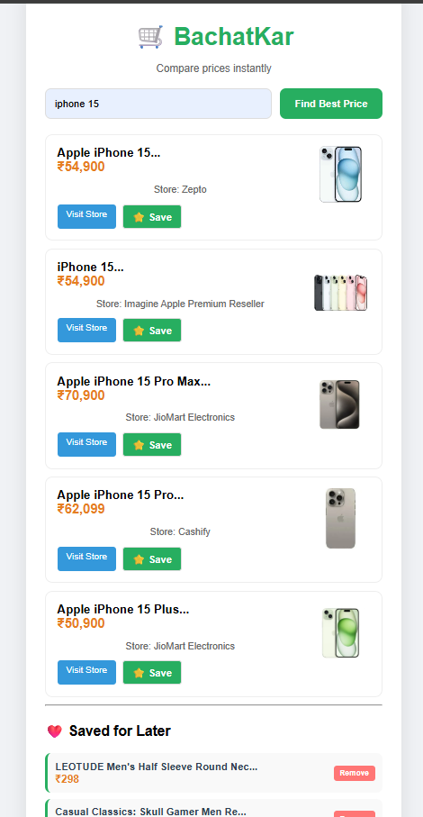

# 🛒 BachatKar – Price Comparison Web App

BachatKar is a web-based price comparison tool that helps users find the best deals across multiple e-commerce platforms. Users can search for a product or paste a product link to compare prices and choose the cheapest option.

---

## 🚀 Features

- 🔍 Search products by name or paste product links
- 💰 Compare prices across multiple platforms
- 🛒 Click and open product directly from results
- ⭐ Save for Later functionality (using local storage)
- ⚡ Fast and responsive UI
- 🌐 Deployed on Vercel

---

## 🧠 How It Works

1. User enters a product name or pastes a product link  
2. The app extracts the product information  
3. It sends a request to an external API  
4. Displays multiple results with prices and store names  
5. User selects the best deal and navigates to the store  

---

## 🛠 Tech Stack

- HTML
- CSS
- JavaScript
- API Integration
- Vercel (Deployment)

---

## 📸 Screenshots



---

## 🔗 Live Demo

👉 https://bachat-kar.vercel.app/

---

## 📂 Installation & Setup

1. Clone the repository:
```bash
git clone https://github.com/Abhishek-ko/BachatKar.git